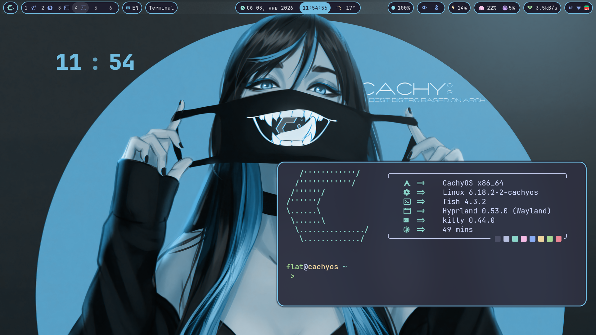

# Catppuccin-Hyprland




## Installation
```bash
sudo pacman -S ayugram-desktop kitty waybar ttf-jetbrains-mono ttf-jetbrains-mono-nerd woff2-font-awesome otf-font-awesome wofi swww yay obsidian file-roller evince nwg-look waypaper firefox hyprlock hypridle hyprsunset hyprcursor grim flameshot xorg freetype2 fish fastfetch starship zoxide fzf thunar jq cliphist wl-clipboard wl-clip-persist git pavucontrol gsimplecal curl wget viewnior file powerline-fonts inetutils udiskie gvfs tumbler ttf-dejavu mpv lsd sl 

yay -S eww swaync-git pfetch zfetch audacious-gtk3 audacious-plugins-gtk3 catppuccin-cursors-macchiato visual-studio-code-bin
```

```bash
git clone https://github.com/Flat447/Catppuccin-hyprland.git
cd Catppuccin-hyprland/
```
```bash
./install.sh
```

In `~/.config/waybar/config_catppuccin.jsonc` replace `flat` on your username

```bash
mkdir -p ~/.config/tmux/plugins && git clone https://github.com/tmux-plugins/tpm ~/.config/tmux/plugins/tpm
```
## Hyprland
### Hotkeys
| Keybinding            | Description                                     |
| :-------------------- | :---------------------------------------------- |
| `Super + Return` | Open terminal                                |
| `Super + Q`   | Kill active window                              |
| `Super + Shift + Ctrl + Q`   | Exit Hyprland                                   |
| `Super + F`           | Toggle floating                                 |
| `Super + F11`   | Toggle fullscreen                               |
| `Super + R`           | Open application menu (`wofi`)                |
| `Super + Shift + V`           | Toggle split                                    |
| `Super + E`           | Open filemanager (`thunar`)                 |
| `Super + V`           | Open clipboard history (`cliphist`)             |
| `Super + Ctrl + B`           | Reload Waybar config                            |
| `Super + Shift + B`   | Toggle Waybar visibility                        |
| `Super + X`           | Launch hyprpicker                               |
| `Super + Shift + X`           | Launch hyprpicker (`RGB`)                               |
| `Super + N`           | Open notification center (`swaync`)             |
| `Ctrl + Shift + O`   | Pass key to OBS                                 |
| `Print`               | Take screenshot (`grim`)                   |
| `Super + (←,→,↑,↓)`   | Move focus                                      |
| `Super + Shift + H, J, K, L` | Swap window                               |
| `Super + H, J, K, L`  | Resize window                             |
| `Super + [1-9]`       | Switch to workspace                             |
| `Super + Shift + [1-9]` | Move window to workspace                      |
| `F1`                | Mute audio                                      |
| `F2`         | Decrease volume                                 |
| `F3`           | Increase volume                                 |
| `F5`           | Increase brightness                             |
| `F6`           | Decrease brightness                             |
| `Super + Mouse`       | Move/Resize window                              |
| `Super + Shift + Return` | Open float terminal                    |
| `Super + Shift E` | Open float filemanager                    |
| `Super + C`       | Wofi calc                                     |
| `Super + M`   | Audacious                                 |
| `Super + P`   | Toggle pseudotile                    |
| `Super + T`   | AyuGram                           |
| `Super + B`   | FireFox                           |
| `Super + Shift + S` | Take screenshot (`flameshot`)   |
| `Super + D`       | Minimizing a window       |
| `Super + Shift + D` | Minimizing all windows      |

## Shell
### Fish
- Staship theme
- Aliases
#### Aliases 

| Alias | Command | Description |
|-------|---------|-------------|
| `ls` | `lsd` | Replace standard ls with lsd |
| `la` | `lsd -a` | Show all files (including hidden) |
| `ll` | `lsd -la` | Detailed list of all files |
| `ff` | `fastfetch` | Launch fastfetch |
| `v` | `vim` | Launch vim |
| `g` | `git` | Launch git |
| `q` | `exit` | Exit terminal |
| `cd` | `z` | Replace cd with z (zoxide) |
| `dn` | `sudo nvim` | Launch nvim with sudo privileges |
| `pizdec` | `sudo archarchive` | Archarchive (sudo) |
| `suka` | `sudo archarchive` | Archarchive (sudo) |
| `blyat` | `sudo archarchive` | Archarchive (sudo) |
| `otkat` | `sudo archarchive` | Archarchive (sudo) |
| `nazad` | `sudo archarchive` | Archarchive (sudo) |
| `mfetch` | `fastfetch -c ~/.config/fastfetch/mini_conf.jsonc` | Fastfetch with mini config |
| `nitch` | `fastfetch -c ~/.config/fastfetch/nitch.jsonc` | Fastfetch with nitch config |
| `update` | `sudo pacman -Syu` | System update (Arch Linux) |
| `sysfetch` | `~/.config/hypr/.sysfetch.sh` | Execute sysfetch script |
| `fetch` | `~/.config/hypr/.fetch.sh` | Execute fetch script |
| `tomas` | `sl` | Steam locomotive animation |
| `n` | `nvim` | Launch neovim |
| `start` | `hyprctl dispatch exec''` | Execute command in Hyprland |
| `arch` | `fastfetch -c ~/.config/fastfetch/arch_config.jsonc` | Fastfetch with Arch config |
| `install` | `sudo pacman -S` | Install packages |
| `remove` | `sudo pacman -R` | Remove packages |
| `query` | `pacman -Qi` | Query package information |
| `clear_pacman_cache` | `sudo pacman -Scc` | Clear pacman cache |
| `zoff` | `sudo systemctl stop zapret.service` | Stop zapret service |
| `zon` | `sudo systemctl start zapret.service` | Start zapret service |
| `webcam` | `mpv av://v4l2:/dev/video0` | View webcam feed with mpv |

## Multiplexer: Tmux
`Tmux` is a lerminal multiplexer

### Hotkeys

| Keybinding            | Description                                     |
| :-------------------- | :---------------------------------------------- |
| `Alt + r`             | Reload config                                   |
| `Alt + s`             | Choose session/window tree                      |
| `Alt + [1-9]`         | Select window                                   |
| `Alt + (←,→,↑,↓)`     | Select pane                                     |
| `Alt + Shift + (←,→,↑,↓)` | Resize pane                                 |
| `Alt + h`             | Split window vertically                         |
| `Alt + v`             | Split window horizontally                       |
| `Alt + Enter`         | New window                                      |
| `Alt + c`             | Kill pane                                       |
| `Alt + q`             | Kill window                                     |
| `Alt + d`             | Detach                                          |
| `Alt + Q`             | Kill session                                    |
| `Alt + /`             | Search forward                                  |
| `Alt + ?`             | Search backward                                 |

## Configured Applications
- Terminal: **[Kitty](https://github.com/kovidgoyal/kitty)**
- Lock Screen: **[Hyprlock](https://wiki.hypr.land/Hypr-Ecosystem/hyprlock/)**
- Notifications: **[SwayNC](https://github.com/ErikReider/SwayNotificationCenter)**
- Bar: **[Waybar](https://github.com/Alexays/Waybar)**
- Applications Launcher: **[Wofi](https://github.com/SimplyCEO/wofi)**
- Fetch: **[Fastfetch](https://github.com/fastfetch-cli/fastfetch)**
## Themes
- GTK Theme: **[Catppuccin Sapphire](https://github.com/Fausto-Korpsvart/Catppuccin-GTK-Theme)**
